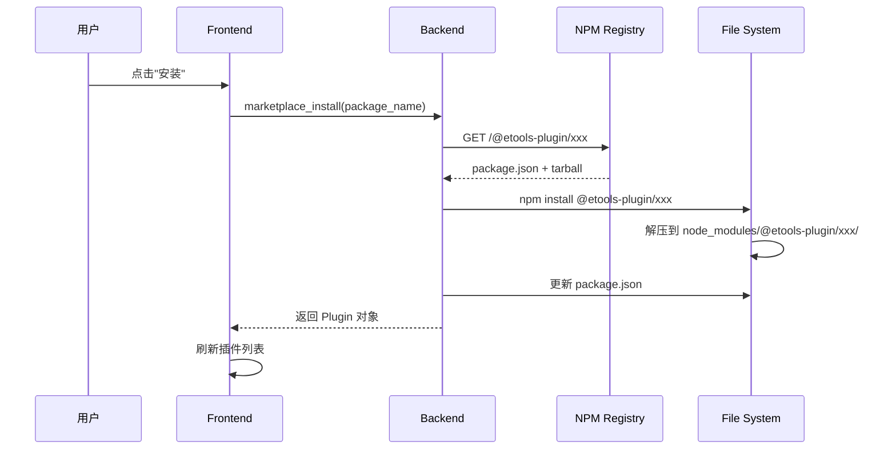
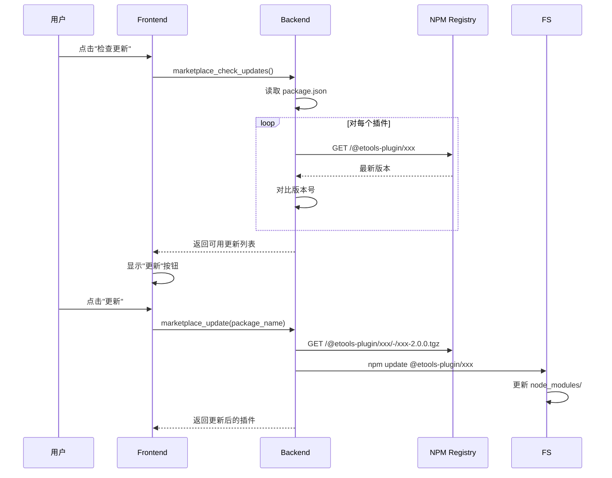
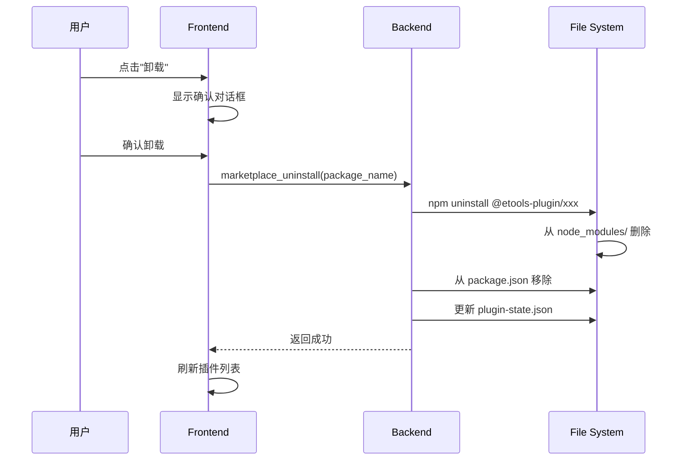

# ETools NPM 插件系统架构文档

## 系统概览

ETools 使用**统一的 NPM 插件管理系统**，完全基于标准的 npm 生态系统。

---

## 架构图

```
┌─────────────────────────────────────────────────────────────────────────┐
│                        NPM Registry                          │
│         https://registry.npmjs.org                      │
│                                                             │
│  ┌─────────────────────────────────────────────────────────┐       │
│  │ @etools-plugin/devtools (v1.2.0)             │       │
│  │   ├─ package.json (npm 元数据)              │       │
│  │   ├─ dist/index.js (编译输出)                │       │
│  │   └─ plugin.json (etools 元数据)           │       │
│  └─────────────────────────────────────────────────────────┘       │
│                                                             │
│  ┌─────────────────────────────────────────────────────────┐       │
│  │ @etools-plugin/hello (v0.1.5)                │       │
│  │   ├─ package.json                            │       │
│  │   ├─ dist/index.js                           │       │
│  │   └─ plugin.json                           │       │
│  └─────────────────────────────────────────────────────────┘       │
└─────────────────────────────────────────────────────────────────┘
                          ↑ ↓ ↓
        ┌──────────────────────────────────┬─────────────────────────┐
        │          NPM Search API      │  Package Info API      │
        └──────────────────────────┬─────┴───────────────────┘
                                │
        ┌───────────────┴───────────────┐
        │   ETools Backend (Rust)   │
        └───────────────┬───────────────┘
                        │
        ┌───────────────┼───────────────┬───────────────────┬───────────────┐
        ↓               ↓               ↓                 ↓
   marketplace_   get_installed_   marketplace_    marketplace_
   search         plugins         install          update
                                                        │
        ┌───────────────┴───────────────┬───────────────────┴───────────────┐
        │   ETools Frontend (React)   │                            │
        └───────────────┬───────────────┘                            │
                        │                                        │
        ┌───────────────┼───────────────┬───────────────────┬───────────────┐
        ↓               ↓               ↓                 ↓
   PluginList     PluginManager     MarketplaceView    Settings
```

---

## 核心组件

### 1. NPM Registry（插件市场）

**职责**：
- 存储所有发布的插件包
- 提供 API 用于搜索、获取包信息
- 处理版本管理和依赖解析
- 提供 CDN 加速下载

**API 端点**：
```
搜索: GET https://registry.npmjs.org/-/v1/search?text=keywords:etools-plugin
包信息: GET https://registry.npmjs.org/@etools-plugin/devtools
下载: GET https://registry.npmjs.org/@etools-plugin/devtools/-/devtools-1.2.0.tgz
```

**插件发现机制**：
- 通过 `keywords` 字段中的 `etools-plugin` 标记
- 所有插件必须包含 `@etools-plugin` 命名空间
- 支持 `description`, `author`, `keywords` 搜索

---

### 2. ETools Backend (Rust)

#### 文件结构

```
src-tauri/src/
├── services/
│   └── marketplace_service.rs          # NPM 市场服务
├── cmds/
│   ├── marketplace.rs                 # NPM 命令
│   └── plugins.rs                   # 插件管理命令
└── models/
    └── plugin.rs                      # 数据模型
```

#### 核心服务：MarketplaceService

**职责**：
- 调用 NPM Registry API
- 执行 npm 命令（install/uninstall/update）
- 管理 plugins/package.json
- 解析插件元数据

**关键方法**：
```rust
impl MarketplaceService {
    // 从 npm 获取插件列表
    pub fn list_plugins(&self, category, page, page_size, handle) -> Result<...>

    // 在 npm 搜索插件
    pub fn search_plugins(&self, query, category, page, page_size, handle) -> Result<...>

    // 安装插件
    pub fn install_plugin(&self, package_name, handle) -> Result<Plugin>

    // 卸载插件
    pub fn uninstall_plugin(&self, package_name, handle) -> Result<()>

    // 更新插件
    pub fn update_plugin(&self, package_name, handle) -> Result<Plugin>

    // 检查更新
    pub fn check_updates(&self, handle) -> Result<Vec<PluginUpdateInfo>>
}
```

#### Tauri 命令

**市场命令** (marketplace.rs):
```rust
#[tauri::command]
pub fn marketplace_list(...) -> Result<MarketplacePluginPage>

#[tauri::command]
pub fn marketplace_search(...) -> Result<MarketplacePluginPage>

#[tauri::command]
pub fn marketplace_install(...) -> Result<Plugin>

#[tauri::command]
pub fn marketplace_uninstall(...) -> Result<()>

#[tauri::command]
pub fn marketplace_update(...) -> Result<Plugin>

#[tauri::command]
pub fn marketplace_check_updates(...) -> Result<Vec<PluginUpdateInfo>>

#[tauri::command]
pub fn marketplace_get_plugin(...) -> Result<MarketplacePlugin>

#[tauri::command]
pub fn get_installed_plugins(...) -> Result<Vec<Plugin>>
```

**插件管理命令** (plugins.rs):
```rust
#[tauri::command]
pub fn plugin_enable(...) -> Result<Plugin>

#[tauri::command]
pub fn plugin_disable(...) -> Result<Plugin>

#[tauri::command]
pub fn plugin_uninstall(...) -> Result<()>

#[tauri::command]
pub fn get_plugin_health(...) -> Result<PluginHealth>

#[tauri::command]
pub fn check_plugin_health(...) -> Result<PluginHealth>

#[tauri::command]
pub fn get_plugin_usage_stats(...) -> Result<PluginUsageStats>

#[tauri::command]
pub fn bulk_enable_plugins(...) -> Result<BulkOperation>

#[tauri::command]
pub fn bulk_disable_plugins(...) -> Result<BulkOperation>

#[tauri::command]
pub fn bulk_uninstall_plugins(...) -> Result<BulkOperation>
```

---

### 3. ETools Frontend (React + TypeScript)

#### 文件结构

```
src/
├── services/
│   ├── pluginManager.ts              # 插件管理服务
│   └── pluginStateStore.ts         # 状态管理（Zustand）
├── components/
│   └── PluginManager/
│       ├── PluginManager.tsx          # 主管理器
│       ├── PluginList.tsx             # 插件列表
│       ├── InstalledPluginsView.tsx    # 已安装视图
│       ├── MarketplaceView.tsx       # 插件市场
│       └── PluginItem.tsx            # 插件项
├── services/
│   └── pluginLoader.ts             # 插件加载器
└── types/
    └── plugin.ts                      # 类型定义
```

#### MarketplaceService

**职责**：
- 调用 Rust Tauri 命令
- 管理插件列表状态
- 处理搜索和过滤
- 显示安装/卸载/更新进度

**关键方法**：
```typescript
class MarketplaceService {
  // 获取市场插件
  async getMarketplacePlugins(options): Promise<{ plugins: Plugin[]; total: number }>

  // 搜索插件
  async searchMarketplace(query, options): Promise<{ plugins: Plugin[]; total: number }>

  // 安装插件
  async installPlugin(packageName): Promise<Plugin>

  // 卸载插件
  async uninstallPlugin(packageName): Promise<void>

  // 更新插件
  async updatePlugin(packageName): Promise<Plugin>

  // 检查更新
  async checkUpdates(): Promise<PluginUpdateInfo[]>

  // 获取已安装插件
  async getInstalledPlugins(): Promise<Plugin[]>
}
```

---

### 4. 插件存储

#### 目录结构

```
{AppData}/plugins/
├── package.json              # npm 依赖清单（核心）
├── node_modules/
│   └── @etools-plugin/
│       ├── devtools/
│       │   ├── package.json    # npm 包元数据
│       │   ├── dist/
│       │   │   ├── index.js     # 编译输出
│       │   │   └── index.d.ts   # 类型声明
│       │   └── plugin.json    # ETools 配置（可选）
│       └── hello/
│           └── ...
└── plugin-state.json         # 插件启用状态
```

#### package.json 结构

```json
{
  "name": "etools-plugins",
  "version": "1.0.0",
  "description": "Installed plugins registry",
  "dependencies": {
    "@etools-plugin/devtools": "latest",
    "@etools-plugin/hello": "^0.1.0",
    "@etools-plugin/json-formatter": "1.0.0"
  }
}
```

#### plugin-state.json 结构

```json
{
  "@etools-plugin/devtools": true,
  "@etools-plugin/hello": false
}
```

---

## 工作流程详解

### 插件安装流程



**详细步骤**：

1. **用户点击"安装"按钮**
   - 前端显示安装进度

2. **前端调用 Rust 命令**
   ```typescript
   const plugin = await invoke('marketplace_install', { packageName: '@etools-plugin/devtools' })
   ```

3. **后端执行 npm install**
   ```rust
   let output = Command::new("npm")
       .args(["install", package_name])
       .current_dir(&plugins_dir)
       .output()?;
   ```

4. **npm 下载包**
   - 从 npm Registry 下载 tarball
   - 解压到 `node_modules/@etools-plugin/xxx/`

5. **后端更新依赖清单**
   ```rust
   // 更新 plugins/package.json
   dependencies[package_name] = "latest";
   ```

6. **后端读取插件元数据**
   ```rust
   // 读取 node_modules/@etools-plugin/xxx/package.json
   // 读取 etools 字段
   ```

7. **返回插件信息**
   ```rust
   Ok(Plugin { id, name, version, ... })
   ```

8. **前端刷新列表**
   - 调用 `get_installed_plugins()`
   - 显示新安装的插件

---

### 插件更新流程



**版本对比逻辑**：

```rust
pub fn compare_versions(current: &str, latest: &str) -> bool {
    // 使用 semver crate 对比版本号
    let v1 = semver::Version::parse(current).unwrap();
    let v2 = semver::Version::parse(latest).unwrap();
    v2 > v1
}
```

---

### 插件卸载流程



---

## 权限系统

### 权限类型

| 权限 | 描述 | Tauri 命令 |
|--------|------|-------------|
| `read_clipboard` | 读取剪贴板 | `get_clipboard_history` |
| `write_clipboard` | 写入剪贴板 | `paste_clipboard_item` |
| `read_files` | 读取文件 | `read_file` |
| `write_files` | 写入文件 | `write_file` |
| `network` | 网络访问 | `fetch` |
| `shell` | Shell 命令 | `execute_shell` |
| `notifications` | 系统通知 | `send_notification` |

### 权限检查

```rust
fn hasPermission(permissions: &[PluginPermission], cmd: &str) -> bool {
    let required = PERMISSION_MAP.get(cmd)?;
    permissions.contains(required)
}
```

### 沙箱执行

插件在隔离的沙箱环境中执行：
- 权限受控访问
- 错误隔离
- 超时保护

---

## 性能优化

### 1. 缓存策略

```typescript
// 插件列表缓存
const pluginListCache = new Map<string, Plugin[]>();

// 搜索结果缓存
const searchCache = new Map<string, SearchResult[]>();

// 缓存失效
setInterval(() => {
    pluginListCache.clear();
    searchCache.clear();
}, 5 * 60 * 1000); // 5 分钟
```

### 2. 懒加载

```typescript
// 插件详情懒加载
const PluginItem = ({ plugin }) => {
  const [details, setDetails] = useState(null);

  return (
    <div>
      <h3>{plugin.name}</h3>
      {details && <PluginDetails details={details} />}
      <button onClick={() => loadDetails()}>查看详情</button>
    </div>
  );
};
```

### 3. 虚拟滚动

```typescript
// 处理大量插件列表
import { FixedSizeList as List } from 'react-window';

const PluginList = ({ plugins }) => {
  return (
    <List
      height={600}
      itemCount={plugins.length}
      itemSize={60}
      width={800}
    >
      {({ index, style }) => (
        <div style={style}>
          <PluginItem plugin={plugins[index]} />
        </div>
      )}
    </List>
  );
};
```

---

## 安全机制

### 1. 包名验证

```rust
fn validate_package_name(package_name: &str) -> Result<(), String> {
    if !package_name.starts_with("@etools-plugin/") {
        return Err("插件包必须使用 @etools-plugin 命名空间".to_string());
    }
    Ok(())
}
```

### 2. 清单验证

```rust
fn validate_manifest(manifest: &PluginManifest) -> ValidationResult {
    let errors = vec![];

    // 检查必需字段
    if manifest.id.is_empty() {
        errors.push("插件 ID 不能为空".to_string());
    }

    if manifest.triggers.is_empty() {
        errors.push("插件必须定义至少一个触发词".to_string());
    }

    // 检查权限
    for perm in &manifest.permissions {
        if !VALID_PERMISSIONS.contains(&perm) {
            errors.push(format!("未知权限: {}", perm));
        }
    }

    ValidationResult { errors, warnings }
}
```

### 3. 核心插件保护

```rust
const CORE_PLUGINS: &[&str] = &["core", "system"];

pub fn plugin_uninstall(plugin_id: String) -> Result<(), String> {
    if CORE_PLUGINS.contains(&plugin_id) {
        return Err(format!("不能卸载核心插件: {}", plugin_id));
    }
    // 执行卸载
}
```

---

## 错误处理

### 错误类型

```typescript
enum PluginError {
    NetworkError,           // 网络错误
    NotFound,              // 插件未找到
    InstallFailed,         // 安装失败
    UninstallFailed,       // 卸载失败
    UpdateFailed,          // 更新失败
    PermissionDenied,      // 权限被拒绝
    ValidationError,      // 验证失败
    CorePluginProtected,   // 核心插件受保护
}
```

### 错误恢复

```typescript
try {
    await installPlugin(packageName);
} catch (error) {
    if (error.type === 'NetworkError') {
        // 显示重试按钮
        showRetryButton();
    } else if (error.type === 'PermissionDenied') {
        // 显示权限请求对话框
        requestPermission(error.permissions);
    } else {
        // 显示通用错误消息
        showError(error.message);
    }
}
```

---

## 监控和调试

### 日志记录

```rust
// Rust 端日志
println!("[Marketplace] Installing plugin: {}", package_name);
println!("[Marketplace] npm install stdout: {}", stdout);

// 错误日志
eprintln!("[Marketplace] Failed to install: {}", error);
```

### 性能指标

```typescript
// 前端性能监控
const start = performance.now();

await installPlugin(packageName);

const duration = performance.now() - start;
logMetrics('plugin_install_duration', duration);

// 超过阈值则警告
if (duration > 5000) {
    console.warn(`插件安装耗时过长: ${duration}ms`);
}
```

---

## 版本历史

| 版本 | 日期 | 变更 |
|-------|------|------|
| 2.0.0 | 2025-01-15 | 统一到 NPM 分发系统 |
| 1.0.0 | 2024-XX-XX | 初始版本（基于自定义市场） |

---

## 相关文档

- **插件管理指南**: `docs/plugin-management.md`
- **NPM 插件规范**: `docs/NPM_PLUGIN_SPEC.md`
- **开发指南**: `docs/NPM_PLUGIN_DEV_GUIDE.md`
- **迁移指南**: `docs/NPM_MIGRATION_GUIDE.md`
- **前端服务**: `src/services/pluginManager.ts`
- **后端服务**: `src-tauri/src/services/marketplace_service.rs`

---

## 常见问题

### Q: 为什么使用 npm 而不是自定义市场？

**A**:
- **零成本**: npm 免费提供 CDN、存储、带宽
- **标准化**: 开发者熟悉的工具链
- **生态系统**: npm 的包管理和版本控制
- **全球分发**: npm 全球 CDN 加速下载
- **依赖管理**: npm 自动处理插件依赖

### Q: 插件如何更新？

**A**:
1. ETools 定期检查 npm Registry 获取最新版本
2. 对比 node_modules 中的当前版本
3. 如果有更新，显示"更新"按钮
4. 用户点击更新后执行 `npm update`
5. npm 自动下载新版本并替换旧版本

### Q: 插件存储在哪里？

**A**:
```
{AppData}/plugins/
├── package.json              # 依赖清单
├── node_modules/             # 插件文件
└── plugin-state.json         # 启用状态
```

- macOS: `~/Library/Application Support/ETools/`
- Windows: `%APPDATA%/ETools/`
- Linux: `~/.config/ETools/`

### Q: 如何开发插件？

**A**:
参考 `docs/NPM_PLUGIN_DEV_GUIDE.md`

1. 创建插件目录
2. 初始化 npm 包
3. 编写插件代码
4. 构建和发布
5. 在 ETools 中测试

---

## 贡献指南

如需改进插件系统：

1. **代码规范**: 遵循 ESLint 和 Rust fmt 规范
2. **测试**: 添加单元测试和 E2E 测试
3. **文档**: 更新相关文档
4. **安全**: 遵循安全最佳实践
5. **性能**: 优化加载和执行性能

---

## 许可证

遵循项目主许可证。
