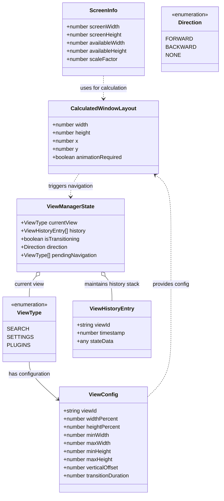
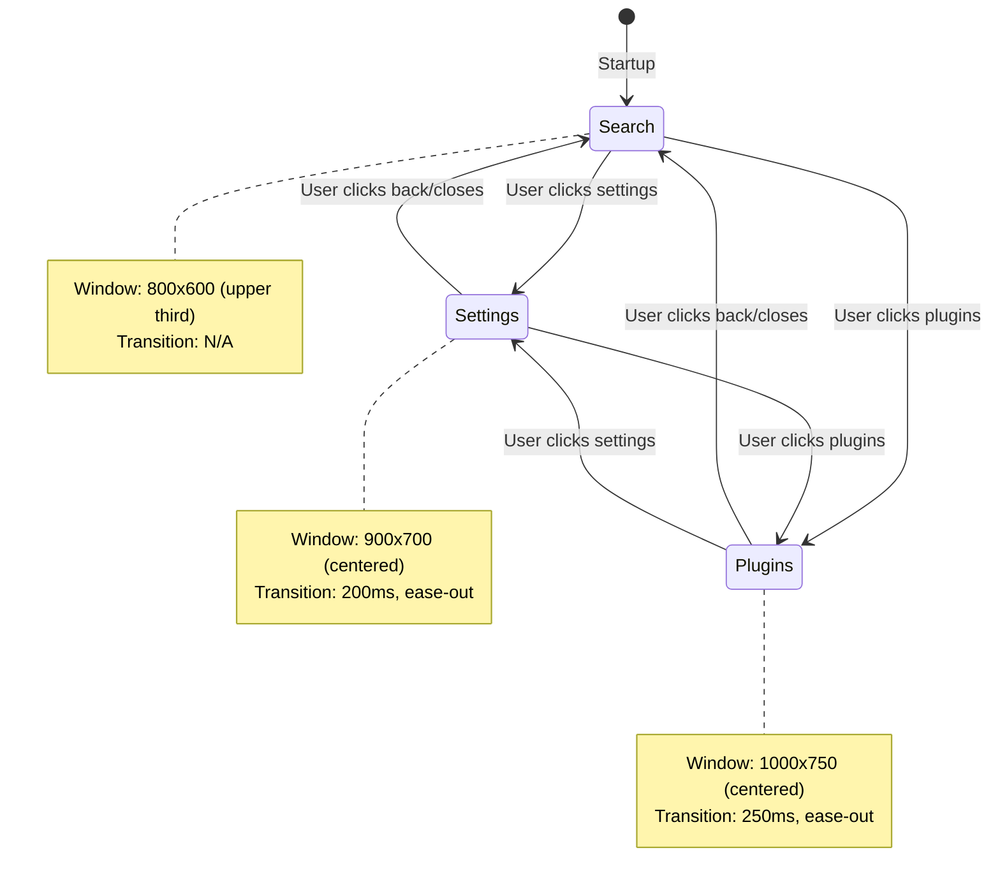
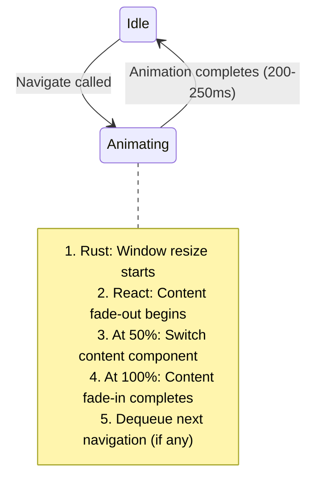

# Data Model: Responsive Single-Window Architecture

**Feature**: 001-responsive-window
**Date**: 2025-01-08
**Status**: Draft

---

## Overview

This document defines all data entities and their relationships for the responsive single-window architecture. Entities are organized by layer (frontend, backend, shared) and include validation rules derived from functional requirements.

---

## Entity Relationships



---

## Backend Entities (Rust)

### ScreenInfo

**Purpose**: Represents the current display characteristics detected from the OS.

**Source**: `src-tauri/src/models/screen_info.rs`

**Fields**:

| Field | Type | Description | Validation |
|-------|------|-------------|------------|
| `screen_width` | `u32` | Total width of the display in physical pixels | Must be > 0, typically 1366-3840 |
| `screen_height` | `u32` | Total height of the display in physical pixels | Must be > 0, typically 768-2160 |
| `available_width` | `u32` | Usable width excluding system UI (menu bar, dock) | Must be <= screen_width |
| `available_height` | `u32` | Usable height excluding system UI | Must be <= screen_height |
| `scale_factor` | `f64` | DPI scaling factor (1.0 = standard, 2.0 = Retina) | Must be > 0, typically 1.0-3.0 |

**Constraints**:
- Derived from FR-014: Must detect on startup
- Derived from FR-015: Must detect screen changes
- Derived from FR-018: Must account for DPI scaling

**Rust Implementation**:

```rust
#[derive(Debug, Clone, Serialize, Deserialize)]
pub struct ScreenInfo {
    pub screen_width: u32,
    pub screen_height: u32,
    pub available_width: u32,
    pub available_height: u32,
    pub scale_factor: f64,
}

impl ScreenInfo {
    pub fn validate(&self) -> Result<(), String> {
        if self.screen_width == 0 || self.screen_height == 0 {
            return Err("Screen dimensions cannot be zero".to_string());
        }
        if self.available_width > self.screen_width {
            return Err("Available width cannot exceed screen width".to_string());
        }
        if self.available_height > self.screen_height {
            return Err("Available height cannot exceed screen height".to_string());
        }
        if self.scale_factor <= 0.0 {
            return Err("Scale factor must be positive".to_string());
        }
        Ok(())
    }
}
```

---

### ViewConfig

**Purpose**: Configuration for each view type's sizing and positioning behavior.

**Source**: `src-tauri/src/models/view_config.rs`

**Fields**:

| Field | Type | Description | Validation |
|-------|------|-------------|------------|
| `view_id` | `String` | Unique identifier for the view | One of: "search", "settings", "plugins" |
| `width_percent` | `f64` | Target width as percentage of screen width | 0.0 - 1.0 |
| `height_percent` | `f64` | Target height as percentage of screen height | 0.0 - 1.0 |
| `min_width` | `u32` | Minimum allowed width in pixels | > 0 |
| `max_width` | `u32` | Maximum allowed width in pixels | > min_width |
| `min_height` | `u32` | Minimum allowed height in pixels | > 0 |
| `max_height` | `u32` | Maximum allowed height in pixels | > min_height |
| `vertical_offset` | `f64` | Position offset from top (-1.0 to 1.0, 0 = centered) | -1.0 to 1.0 |
| `transition_duration` | `u64` | Animation duration in milliseconds | 200-250 |

**Default Configurations** (from FR-002, FR-003):

```rust
impl ViewConfig {
    pub fn search() -> Self {
        Self {
            view_id: "search".to_string(),
            width_percent: 0.35,
            height_percent: 0.40,
            min_width: 500,
            max_width: 800,
            min_height: 300,
            max_height: 600,
            vertical_offset: 0.20, // Upper portion (20% from top)
            transition_duration: 200,
        }
    }

    pub fn settings() -> Self {
        Self {
            view_id: "settings".to_string(),
            width_percent: 0.40,
            height_percent: 0.50,
            min_width: 600,
            max_width: 900,
            min_height: 400,
            max_height: 700,
            vertical_offset: 0.0, // Centered
            transition_duration: 250,
        }
    }

    pub fn plugins() -> Self {
        Self {
            view_id: "plugins".to_string(),
            width_percent: 0.45,
            height_percent: 0.55,
            min_width: 650,
            max_width: 1000,
            min_height: 450,
            max_height: 750,
            vertical_offset: 0.0, // Centered
            transition_duration: 250,
        }
    }
}
```

**Constraints**:
- Derived from FR-002, FR-003: Must respect min/max constraints
- Derived from FR-006, FR-007: Search upper, others centered
- Derived from FR-008: Transition duration 200-250ms

---

### CalculatedWindowLayout

**Purpose**: Result of window size calculation with final dimensions and position.

**Source**: `src-tauri/src/models/window_layout.rs`

**Fields**:

| Field | Type | Description | Validation |
|-------|------|-------------|------------|
| `width` | `u32` | Final window width in pixels | Within ViewConfig min/max |
| `height` | `u32` | Final window height in pixels | Within ViewConfig min/max |
| `x` | `i32` | Window X position in pixels | Within screen bounds |
| `y` | `i32` | Window Y position in pixels | Within screen bounds |
| `animation_required` | `bool` | Whether transition animation is needed | Determined by size delta |

**Rust Implementation**:

```rust
#[derive(Debug, Clone, Serialize, Deserialize)]
pub struct CalculatedWindowLayout {
    pub width: u32,
    pub height: u32,
    pub x: i32,
    pub y: i32,
    pub animation_required: bool,
}

impl CalculatedWindowLayout {
    pub fn new(
        width: u32,
        height: u32,
        x: i32,
        y: i32,
        current_width: Option<u32>,
    ) -> Self {
        let animation_required = match current_width {
            Some(current) => (current as i32 - width as i32).abs() > 10,
            None => true,
        };

        Self {
            width,
            height,
            x,
            y,
            animation_required,
        }
    }

    pub fn validate(&self, screen_info: &ScreenInfo) -> Result<(), String> {
        // Check if window fits within screen
        if self.width > screen_info.available_width {
            return Err(format!(
                "Window width {} exceeds available width {}",
                self.width, screen_info.available_width
            ));
        }
        if self.height > screen_info.available_height {
            return Err(format!(
                "Window height {} exceeds available height {}",
                self.height, screen_info.available_height
            ));
        }

        // Check if window is positioned on screen
        if self.x < 0 || self.x + self.width as i32 > screen_info.screen_width as i32 {
            return Err("Window X position is off-screen".to_string());
        }
        if self.y < 0 || self.y + self.height as i32 > screen_info.screen_height as i32 {
            return Err("Window Y position is off-screen".to_string());
        }

        Ok(())
    }
}
```

**Constraints**:
- Derived from FR-004: Must maintain 20px margins from edges
- Derived from FR-035: Must prevent off-screen positioning

---

## Frontend Entities (TypeScript)

### ViewType

**Purpose**: Enumeration of all supported view types.

**Source**: `src/types/view.ts`

```typescript
export type ViewType = 'search' | 'settings' | 'plugins';
```

---

### ViewHistoryEntry

**Purpose**: Record of a view visit for back navigation support.

**Source**: `src/types/viewHistory.ts`

**Fields**:

| Field | Type | Description | Required |
|-------|------|-------------|----------|
| `viewId` | `ViewType` | Which view was visited | Yes |
| `timestamp` | `number` | Unix timestamp in milliseconds | Yes |
| `stateData` | `any` | Optional state snapshot for restoring view | No |

**TypeScript Implementation**:

```typescript
export interface ViewHistoryEntry {
  viewId: ViewType;
  timestamp: number;
  stateData?: {
    scrollPosition?: number;
    focusedInputId?: string;
    [key: string]: any;
  };
}
```

**Constraints**:
- Derived from FR-019: Maximum 50 entries in history stack
- Derived from FR-020: Push to history before navigation
- Derived from FR-028: Preserve view state when switching

---

### ViewManagerState

**Purpose**: Central state for view navigation and transitions.

**Source**: `src/stores/viewManagerStore.ts`

**Fields**:

| Field | Type | Description | Default |
|-------|------|-------------|---------|
| `currentView` | `ViewType` | Currently active view | `'search'` |
| `history` | `ViewHistoryEntry[]` | Navigation history stack | `[]` |
| `isTransitioning` | `boolean` | Whether view transition is in progress | `false` |
| `direction` | `Direction` | Navigation direction for animations | `'none'` |
| `pendingNavigation` | `ViewType[]` | Queue of pending navigation requests | `[]` |

**TypeScript Implementation**:

```typescript
import { create } from 'zustand';
import type { ViewType, ViewHistoryEntry } from '@/types';

type Direction = 'forward' | 'backward' | 'none';

interface ViewManagerState {
  // State
  currentView: ViewType;
  history: ViewHistoryEntry[];
  isTransitioning: boolean;
  direction: Direction;
  pendingNavigation: ViewType[];

  // Actions
  navigateToView: (view: ViewType) => Promise<void>;
  goBack: () => Promise<void>;
  canGoBack: () => boolean;
  clearHistory: () => void;
  setIsTransitioning: (transitioning: boolean) => void;
}

export const useViewManagerStore = create<ViewManagerState>((set, get) => ({
  // Initial state
  currentView: 'search',
  history: [],
  isTransitioning: false,
  direction: 'none',
  pendingNavigation: [],

  // Navigate to a new view
  navigateToView: async (view: ViewType) => {
    const { isTransitioning, currentView, history } = get();

    // Queue if transitioning
    if (isTransitioning) {
      set({ pendingNavigation: [...get().pendingNavigation, view] });
      return;
    }

    // Push to history
    const entry: ViewHistoryEntry = {
      viewId: currentView,
      timestamp: Date.now(),
      stateData: {
        scrollPosition: window.scrollY,
        focusedInputId: (document.activeElement as HTMLInputElement)?.id,
      },
    };

    set({
      history: [...history, entry].slice(-50), // FR-019: Max 50 entries
      direction: 'forward',
      isTransitioning: true,
      currentView: view,
    });

    // Trigger window resize
    await invoke('resize_window_smart', {
      viewId: view,
    });

    // Content transition happens in parallel (see Transition component)
  },

  // Go back to previous view
  goBack: async () => {
    const { history, isTransitioning } = get();

    if (history.length === 0) return;
    if (isTransitioning) {
      // Queue if transitioning
      return;
    }

    const previousEntry = history[history.length - 1];
    const newHistory = history.slice(0, -1);

    set({
      history: newHistory,
      direction: 'backward',
      isTransitioning: true,
      currentView: previousEntry.viewId,
    });

    // Trigger window resize
    await invoke('resize_window_smart', {
      viewId: previousEntry.viewId,
    });
  },

  // Check if back navigation is possible
  canGoBack: () => {
    return get().history.length > 0;
  },

  // Clear navigation history
  clearHistory: () => {
    set({ history: [] });
  },

  // Set transitioning state (called by animation system)
  setIsTransitioning: (transitioning: boolean) => {
    const { pendingNavigation } = get();

    set({ isTransitioning: transitioning });

    // Process next queued navigation
    if (!transitioning && pendingNavigation.length > 0) {
      const next = pendingNavigation[0];
      set({ pendingNavigation: pendingNavigation.slice(1) });
      get().navigateToView(next);
    }
  },
}));
```

**Constraints**:
- Derived from FR-011: Queue navigation if animation in progress
- Derived from FR-012: Support forward direction
- Derived from FR-013: Support backward direction
- Derived from FR-022: Clear forward history on new navigation
- Derived from FR-029: Complete transitions within 250ms

---

## Calculation Logic

### Window Size Calculation

**Source**: `src-tauri/src/services/window_calculator.rs`

**Algorithm** (from FR-001 through FR-007):

```rust
pub fn calculate_window_layout(
    screen_info: &ScreenInfo,
    config: &ViewConfig,
    current_size: Option<(u32, u32)>,
) -> Result<CalculatedWindowLayout, String> {
    // 1. Calculate from percentages
    let mut width = (screen_info.available_width as f64 * config.width_percent) as u32;
    let mut height = (screen_info.available_height as f64 * config.height_percent) as u32;

    // 2. Apply min/max constraints (FR-002, FR-003)
    width = width.clamp(config.min_width, config.max_width);
    height = height.clamp(config.min_height, config.max_height);

    // 3. Apply 20px margins (FR-004)
    let margin_x: u32 = 20;
    let margin_y: u32 = 20;
    let max_width = screen_info.available_width.saturating_sub(2 * margin_x);
    let max_height = screen_info.available_height.saturating_sub(2 * margin_y);

    width = width.min(max_width);
    height = height.min(max_height);

    // 4. Calculate position
    let x = ((screen_info.screen_width - width) / 2) as i32;

    let y = if config.vertical_offset == 0.0 {
        // Centered (FR-007)
        ((screen_info.screen_height - height) / 2) as i32
    } else {
        // Upper portion for search (FR-006)
        let offset_y = (screen_info.screen_height as f64 * config.vertical_offset) as i32;
        offset_y - (height as i32 / 2)
    };

    // 5. Create layout
    let current_width = current_size.map(|(w, _)| w);
    let layout = CalculatedWindowLayout::new(width, height, x, y, current_width);

    // 6. Validate
    layout.validate(screen_info)?;

    Ok(layout)
}
```

**Edge Cases Handled**:
- Small screens (1366x768): Width/height clamped to fit
- Large screens (4K): Width/height limited by max constraints
- DPI scaling (Retina): Uses logical pixels, OS handles physical conversion
- Screen changes: Recalculates based on current monitor info

---

## State Transitions

### Navigation Flow



### Animation States



**Transition Coordination** (from FR-010):

1. User clicks "Settings"
2. Frontend calls `invoke('resize_window_smart', { viewId: 'settings' })`
3. Rust animates window size from 800x600 to 900x700 over 200ms
4. Rust emits `window:resize_start` event
5. React receives event, begins content fade-out (opacity: 1 → 0)
6. At 50% (100ms), React switches content component (SearchView → SettingsView)
7. At 100% (200ms), content fade-in completes (opacity: 0 → 1)
8. `isTransitioning` set to `false`, process next queued navigation

---

## Validation Rules Summary

| Entity | Rule | Requirement Source |
|--------|------|-------------------|
| ScreenInfo | All dimensions > 0 | FR-014 |
| ScreenInfo | available_* <= screen_* | FR-014 |
| ViewConfig | 0.0 <= percent <= 1.0 | FR-001 |
| ViewConfig | min_width < max_width | FR-002, FR-003 |
| ViewConfig | 200 <= duration <= 250 | FR-008 |
| CalculatedWindowLayout | Fits within screen | FR-004 |
| CalculatedWindowLayout | 20px margins | FR-004 |
| ViewHistoryEntry | Max 50 entries | FR-019 |
| ViewManagerState | Queue navigation if transitioning | FR-011 |

---

## Performance Considerations

### Caching Strategy (FR-032)

```typescript
// Cache screen info for 5 seconds
let cachedScreenInfo: ScreenInfo | null = null;
let cacheTimestamp: number = 0;

async function getScreenInfo(): Promise<ScreenInfo> {
  const now = Date.now();

  if (cachedScreenInfo && (now - cacheTimestamp) < 5000) {
    return cachedScreenInfo;
  }

  cachedScreenInfo = await invoke('get_screen_info');
  cacheTimestamp = now;

  setTimeout(() => {
    cachedScreenInfo = null;
  }, 5000);

  return cachedScreenInfo;
}
```

### Lazy Loading (FR-031)

```typescript
// Lazy load view components
const SearchView = lazy(() => import('./views/SearchView'));
const SettingsView = lazy(() => import('./views/SettingsView'));
const PluginsView = lazy(() => import('./views/PluginsView'));

// Render with Suspense
<Suspense fallback={<Spinner />}>
  {currentView === 'search' && <SearchView />}
  {currentView === 'settings' && <SettingsView />}
  {currentView === 'plugins' && <PluginsView />}
</Suspense>
```

---

## Next Steps

1. **Phase 1**: Generate contracts/ for API boundaries
   - `get_screen_info` command contract
   - `resize_window_smart` command contract
   - Frontend service interfaces

2. **Phase 1**: Generate quickstart.md for developer onboarding

3. **Phase 2**: Generate tasks.md with implementation steps
