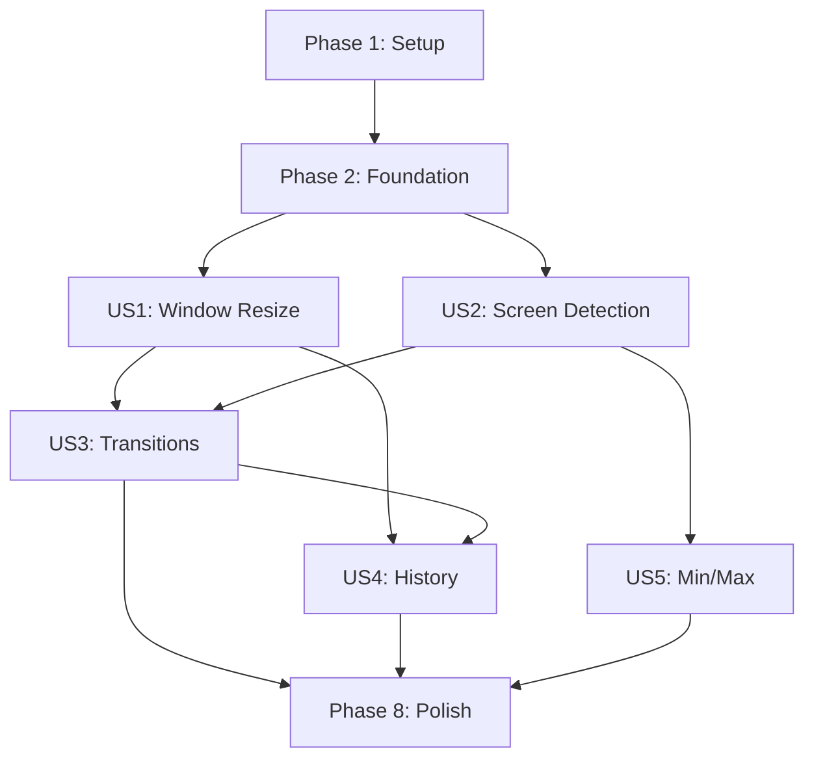

# Implementation Tasks: Responsive Single-Window Architecture

**Feature**: 001-responsive-window
**Branch**: `001-responsive-window`
**Date**: 2025-01-08
**Status**: Ready for Implementation

---

## Overview

This document breaks down the implementation of the responsive single-window architecture into actionable tasks. Tasks are organized by user story to enable independent implementation, testing, and incremental delivery.

**Total Tasks**: 52
**Estimated Duration**: 3-5 days for full implementation

---

## Task Legend

- **[P]**: Parallelizable (can run simultaneously with other [P] tasks)
- **[US1]**: User Story 1 - Dynamic Window Resize (P1)
- **[US2]**: User Story 2 - Screen Size Detection (P1)
- **[US3]**: User Story 3 - Smooth View Transitions (P2)
- **[US4]**: User Story 4 - View History Management (P2)
- **[US5]**: User Story 5 - Minimum/Maximum Size Constraints (P3)

---

## Implementation Strategy

### MVP Approach
**Minimum Viable Product**: Complete US1 and US2 (both P1 priority)
- Delivers core single-window architecture
- Enables dynamic window resizing based on screen size
- Provides immediate value to users
- Independent and testable increment

### Incremental Delivery
1. **Sprint 1**: MVP (US1 + US2) → Basic responsive windows
2. **Sprint 2**: Polish (US3) → Smooth animations
3. **Sprint 3**: Navigation (US4) → History management
4. **Sprint 4**: Edge Cases (US5) → Min/max constraints

---

## Phase 1: Setup & Foundation

**Goal**: Establish project infrastructure and blocking prerequisites for all user stories.

### Tasks

- [ ] T001 Verify Tauri 2.0 installation and window API access in project root
- [ ] T002 [P] Create `src-tauri/src/models/` directory structure
- [ ] T003 [P] Create `src-tauri/src/services/` directory structure
- [ ] T004 [P] Create `src-tauri/src/cmds/` directory structure
- [ ] T005 [P] Create `src/types/` directory structure in src
- [ ] T006 [P] Create `src/services/` directory structure in src
- [ ] T007 [P] Create `src/stores/` directory structure in src
- [ ] T008 [P] Create `src/hooks/` directory structure in src
- [ ] T009 Add `serde` and `tokio` dependencies to `src-tauri/Cargo.toml` if not present
- [ ] T010 Verify Zustand is installed in `package.json` for frontend state management

**Acceptance Criteria**:
- All directory structures created
- Dependencies verified and installed
- Project compiles without errors

---

## Phase 2: Foundational - Data Models & Core Services

**Goal**: Implement shared data entities and backend services needed by all user stories.

### Backend Models

- [ ] T011 [P] Create ScreenInfo struct in `src-tauri/src/models/screen_info.rs` with validation
- [ ] T012 [P] Create ViewConfig struct in `src-tauri/src/models/view_config.rs` with defaults for search/settings/plugins
- [ ] T013 [P] Create CalculatedWindowLayout struct in `src-tauri/src/models/window_layout.rs` with validation

### Backend Services

- [ ] T014 Implement screen_detector service in `src-tauri/src/services/screen_detector.rs` using Tauri's window.current_monitor()
- [ ] T015 Implement window_calculator service in `src-tauri/src/services/window_calculator.rs` with percentage-based sizing algorithm
- [ ] T016 Add modules export in `src-tauri/src/models/mod.rs` for all model structs
- [ ] T017 Add modules export in `src-tauri/src/services/mod.rs` for all services

### Frontend Types

- [ ] T018 [P] Create ViewType type definition in `src/types/view.ts`
- [ ] T019 [P] Create ScreenInfo interface in `src/types/screen.ts`
- [ ] T020 [P] Create ViewHistoryEntry interface in `src/types/viewHistory.ts`
- [ ] T021 [P] Create event payload interfaces in `src/types/events.ts` (ResizeStartPayload, ResizeCompletePayload, ScreenChangedPayload)

**Acceptance Criteria**:
- All Rust structs compile and pass validation
- TypeScript types are properly exported
- Services can be imported and used

---

## Phase 3: User Story 1 - Dynamic Window Resize (P1)

**Goal**: Users experience smooth window size transitions when switching between views, with window automatically adapting to screen size.

**Independent Test**: Launch app on 13" MacBook (2560x1600), open search view (800x600), click settings → window animates to 900x700 and centers vertically.

### Backend Commands

- [ ] T022 [US1] Implement `get_screen_info` Tauri command in `src-tauri/src/cmds/window.rs` calling screen_detector service
- [ ] T023 [US1] Implement `resize_window_smart` Tauri command in `src-tauri/src/cmds/window.rs` with frame-based ease-out animation (12 frames, 200-250ms)
- [ ] T024 [US1] Add event emission for `window:resize_start` in resize_window_smart command
- [ ] T025 [US1] Add event emission for `window:resize_complete` in resize_window_smart command
- [ ] T026 [US1] Register new commands in `src-tauri/src/lib.rs` invoke_handler

### Frontend Services

- [ ] T027 [US1] Implement screenService in `src/services/screenService.ts` with 5-second cache TTL
- [ ] T028 [US1] Implement windowService in `src/services/windowService.ts` wrapping resize_window_smart command
- [ ] T029 [US1] Add event listeners for resize_start and resize_complete in windowService

### State Management

- [ ] T030 [US1] Create viewManagerStore in `src/stores/viewManagerStore.ts` using Zustand with currentView, isTransitioning, direction state
- [ ] T031 [US1] Implement navigateToView action in viewManagerStore that calls invoke('resize_window_smart')
- [ ] T032 [US1] Implement setIsTransitioning action in viewManagerStore for animation coordination

### Hooks & Components

- [ ] T033 [US1] Create useViewNavigation hook in `src/hooks/useViewNavigation.ts` wrapping viewManagerStore
- [ ] T034 [US1] Create ViewContainer component in `src/components/ViewContainer.tsx` with lazy-loaded SearchView, SettingsView, PluginsView
- [ ] T035 [US1] Add ViewContainer.css with fade and slide animations for transitions
- [ ] T036 [US1] Update App.tsx to render ViewContainer instead of separate window components

**Acceptance Criteria**:
- Switching from search to settings animates window from 800x600 to 900x700 over 200ms
- Window positions correctly (search: upper third, settings: centered)
- Animation uses ease-out easing function
- No content clipping during resize
- Transitions complete within 250ms

**Dependencies**:
- Requires Phase 2 complete (all models and services)

---

## Phase 4: User Story 2 - Screen Size Detection and Adaptation (P1)

**Goal**: Application automatically detects screen dimensions and calculates optimal window sizes, ensuring windows never exceed screen boundaries.

**Independent Test**: Run app on different displays (13" MBP, 16" MBP, external 1080p, 4K) and verify window sizes are appropriate for each (respects min/max, fits within screen).

### Backend Enhancement

- [ ] T037 [US2] Add screen change detection in `src-tauri/src/services/screen_detector.rs` using monitor event listeners
- [ ] T038 [US2] Implement event emission for `screen:changed` event when resolution or display configuration changes
- [ ] T039 [US2] Add DPI scaling factor handling in screen_detector using monitor.scale_factor()

### Frontend Enhancement

- [ ] T040 [US2] Implement onScreenChanged listener in screenService to invalidate cache on screen changes
- [ ] T041 [US2] Add useScreenInfo hook in `src/hooks/useScreenInfo.ts` for automatic screen info updates

### Integration

- [ ] T042 [US2] Update viewManagerStore to listen for screen:changed events and recalculate current view size if needed
- [ ] T043 [US2] Add fallback defaults in screenService (640x400 for search, 700x600 for settings) when screen detection fails (FR-033)

**Acceptance Criteria**:
- Screen detection works on 13" MBP (2560x1600, scale=2.0)
- Screen detection works on 16" MBP (3024x1890, scale=2.0)
- Screen detection works on 27" display (2560x1440, scale=1.0)
- Screen detection works on 4K display (3840x2160)
- Window sizes respect min/max constraints on all displays
- Screen changes trigger cache invalidation
- Falls back to defaults if detection fails

**Dependencies**:
- Requires US1 complete (window resize infrastructure)

---

## Phase 5: User Story 3 - Smooth View Transitions (P2)

**Goal**: Users experience fluid animations when switching views, with both window size and content transitioning smoothly.

**Independent Test**: Rapidly switch between views and observe animation smoothness. Search content fades out sliding left, window resizes over 200ms, settings content fades in from right.

### Frontend Services

- [ ] T044 [US3] Implement viewTransitionService in `src/services/viewTransitionService.ts` orchestrating window resize + content fade
- [ ] T045 [US3] Add fadeOut method in viewTransitionService with slide animation (forward: -20px, backward: 20px)
- [ ] T046 [US3] Add fadeIn method in viewTransitionService with slide animation (forward: 20px, backward: -20px)

### Component Enhancement

- [ ] T047 [US3] Update ViewContainer.tsx to listen for resize_start and resize_complete events
- [ ] T048 [US3] Coordinate content fade with window resize (start fade-out on resize_start, switch content at 50%, complete fade-in on resize_complete)
- [ ] T049 [US3] Add direction-based animations in ViewContainer.css (view--forward slides in from right, view--backward slides in from left)

### State Management Enhancement

- [ ] T050 [US3] Add pendingNavigation queue to viewManagerStore for handling rapid navigation requests (FR-011)
- [ ] T051 [US3] Implement queue processing logic in setIsTransitioning to process next pending navigation after current animation completes

**Acceptance Criteria**:
- Content fades out and slides left when navigating forward
- Window resizes simultaneously with content fade
- Content switches at 50% of animation (100ms)
- Content fades in and slides from opposite direction
- Animations maintain 30fps minimum
- Rapid navigation requests are queued and processed sequentially
- Total transition time: 200-250ms

**Dependencies**:
- Requires US1 complete (window resize)
- Requires US2 complete (screen detection)

---

## Phase 6: User Story 4 - View History Management (P2)

**Goal**: Users can navigate back to previous views using back button or keyboard shortcut, with application maintaining history stack.

**Independent Test**: Navigate search → settings → plugins, click back → returns to settings. Press Escape → returns to search. History has max 50 entries.

### State Management Enhancement

- [ ] T052 [US4] Add history array to viewManagerStore (ViewHistoryEntry[], max 50 entries)
- [ ] T053 [US4] Implement history push logic in navigateToView (push current view before navigating)
- [ ] T054 [US4] Implement goBack action in viewManagerStore (pop from history, navigate to previous view)
- [ ] T055 [US4] Implement canGoBack selector in viewManagerStore
- [ ] T056 [US4] Add direction tracking for backward navigation (direction: 'backward')

### Components

- [ ] T057 [US4] Create BackButton component in `src/components/BackButton.tsx` using goBack action
- [ ] T058 [US4] Add Escape key listener in ViewContainer.tsx to trigger goBack when on settings/plugins views

**Acceptance Criteria**:
- Navigating search → settings → plugins → back returns to settings
- Pressing Escape on settings returns to search
- History maintains max 50 entries (FR-019)
- Back button disabled when on initial search view
- History cleared when navigating to new view (not back)
- Backward navigation reverses animation direction (slides in from left)

**Dependencies**:
- Requires US1 complete (navigation infrastructure)
- Requires US3 complete (transition animations)

---

## Phase 7: User Story 5 - Min/Max Size Constraints (P3)

**Goal**: Application enforces minimum and maximum window sizes to ensure usability, preventing windows from becoming too small or too large.

**Independent Test**: Test on 4K display (3840x2160) - window respects max constraints. Test on 1024x768 display - window fits with 20px margins.

### Backend Enhancement

- [ ] T059 [US5] Verify ViewConfig min/max constraints in `src-tauri/src/models/view_config.rs` (search: 500-800px, settings: 600-900px, plugins: 650-1000px)
- [ ] T060 [US5] Add validation in window_calculator service to enforce 20px margins from screen edges (FR-004)
- [ ] T061 [US5] Add off-screen position check in CalculatedWindowLayout.validate() method
- [ ] T062 [US5] Implement margin reduction logic for very small screens (< 1366x768) to ensure window fits

### Testing

- [ ] T063 [US5] Test window sizing on 4K display (3840x2160) - verify max constraints respected
- [ ] T064 [US5] Test window sizing on 13" MBP (2560x1600) - verify within min/max range
- [ ] T065 [US5] Test window sizing on small screen (1366x768) - verify fits with margins
- [ ] T066 [US5] Test window sizing on very small screen (1024x768) - verify reduced margins if needed

**Acceptance Criteria**:
- Search window never exceeds 800px width on any screen
- Settings window never exceeds 900px width on any screen
- Plugins window never exceeds 1000px width on any screen
- Window never smaller than min constraints (500px for search, 600px for settings, 650px for plugins)
- Window maintains 20px margins from screen edges (reduced on very small screens if needed)
- No window appears partially off-screen
- All windows fully visible on screen sizes from 1024x768 to 3840x2160

**Dependencies**:
- Requires US2 complete (screen detection)
- Can be implemented in parallel with US3 and US4

---

## Phase 8: Polish & Cross-Cutting Concerns

**Goal**: Finalize implementation with error handling, performance optimization, code cleanup, and documentation.

### Error Handling

- [ ] T067 Add comprehensive error logging in all Tauri commands with Result<T, String> returns
- [ ] T068 Implement graceful degradation in resize_window_smart (snap to size if animation fails per FR-036)
- [ ] T069 Add user-friendly error messages in frontend services for common errors (NO_MONITOR, PERMISSION_DENIED)

### Performance Optimization

- [ ] T070 Verify screen info caching works correctly (5-second TTL)
- [ ] T071 Profile animation performance to ensure 30fps minimum (use browser DevTools)
- [ ] T072 Add React.lazy() code splitting for SearchView, SettingsView, PluginsView if not already present
- [ ] T073 Verify window resize calculations complete in under 10ms (add timing logs)

### Code Quality

- [ ] T074 Add inline code comments to all public APIs explaining parameters and return values
- [ ] T075 Run `cargo clippy` on Rust backend and fix all warnings
- [ ] T076 Run `cargo fmt` on Rust backend for consistent formatting
- [ ] T077 Run ESLint on TypeScript frontend and fix all warnings
- [ ] T078 Add TypeScript strict mode compliance checks

### Testing

- [ ] T079 Write unit tests for window_calculator service in `src-tauri/tests/window_calculator_test.rs`
- [ ] T080 Write integration tests for get_screen_info command in `src-tauri/tests/integration_test.rs`
- [ ] T081 Write integration tests for resize_window_smart command in `src-tauri/tests/integration_test.rs`
- [ ] T082 Write unit tests for screenService in `src/services/screenService.test.ts`
- [ ] T083 Write unit tests for viewManagerStore in `src/stores/viewManagerStore.test.ts`
- [ ] T084 Write component tests for ViewContainer in `src/components/ViewContainer.test.tsx`

### Documentation

- [ ] T085 Update CLAUDE.md with new single-window architecture description
- [ ] T086 Remove deprecated multi-window code from codebase (old show_settings_window, hide_settings_window commands)
- [ ] T087 Clean up unused imports in all modified files
- [ ] T088 Add JSDoc comments to all frontend service interfaces

### Manual Testing

- [ ] T089 Test full navigation flow on 13" MacBook Pro (search → settings → plugins → back)
- [ ] T090 Test animation smoothness on 13" MacBook Pro (verify 30fps minimum)
- [ ] T091 Test on 16" MacBook Pro with external display (verify screen detection adapts)
- [ ] T092 Test on very small screen (1366x768 or smaller) to verify window fits
- [ ] T093 Test rapid navigation clicks to verify queue processing
- [ ] T094 Test screen resolution change (disconnect external monitor) to verify recalculation
- [ ] T095 Test all acceptance scenarios from spec.md (5 scenarios per user story × 5 stories = 25 scenarios)

**Acceptance Criteria**:
- All code passes linter checks
- All unit tests pass (80%+ coverage for calculation logic)
- All integration tests pass
- All manual test scenarios pass
- Code is documented with comments
- Deprecated code removed
- Performance targets met (<250ms transitions, 30fps animations)

---

## Dependencies & Execution Order



**Critical Path**: Phase 1 → Phase 2 → US1 → US3 → US4 → Polish
**Parallel Opportunities**:
- US2 can run in parallel with US1 after Phase 2
- US5 can run in parallel with US3 and US4 after US2

---

## Parallel Execution Examples

### After Phase 2 Complete

**Can run in parallel** (all [P] tasks within each phase):
- US1 tasks (T022-T036) - 15 tasks
- US2 tasks (T037-T043) - 7 tasks
- US5 tasks (T059-T066) - 8 tasks

### After US1 Complete

**Can run in parallel**:
- US3 tasks (T044-T051) - 8 tasks
- US4 tasks (T052-T058) - 7 tasks

---

## Testing Strategy

### Unit Tests (Backend)
- **Target**: 80%+ coverage for calculation logic
- **Files**: `src-tauri/tests/window_calculator_test.rs`
- **Focus**: Size calculation algorithm, min/max constraints, position calculation

### Unit Tests (Frontend)
- **Target**: 70%+ coverage for services and stores
- **Files**: `src/services/*.test.ts`, `src/stores/*.test.ts`
- **Focus**: State management, navigation logic, caching

### Integration Tests
- **Target**: All Tauri commands
- **Files**: `src-tauri/tests/integration_test.rs`
- **Focus**: Command invocation, error handling, event emissions

### E2E Tests
- **Target**: 5 critical user flows
- **Files**: `e2e/window-resize.spec.ts`
- **Focus**: Full navigation flows, animation smoothness, screen detection

### Manual Tests
- **Target**: 25 acceptance scenarios (5 per user story)
- **Hardware**: 13" MBP, 16" MBP, external 1080p, 4K display
- **Focus**: Real-world usage, edge cases, performance

---

## MVP Scope

**Minimum Viable Product**: Phase 1 + Phase 2 + US1 + US2

**Tasks**: T001-T043 (43 tasks)
**Estimated Duration**: 2-3 days
**Deliverables**:
- Single-window architecture
- Dynamic window resizing based on view
- Screen size detection and adaptation
- Percentage-based sizing with min/max constraints
- Basic window position calculation

**What's NOT in MVP**:
- Smooth view transitions (US3) - uses instant resize instead
- Navigation history (US4) - no back button support
- Advanced animations - no fade/slide effects

**Post-MVP Enhancements**:
- Add US3 for smooth transitions (1 day)
- Add US4 for history management (0.5 day)
- Add US5 for enhanced min/max handling (0.5 day)
- Polish and testing (1 day)

---

## Format Validation

**Checklist Compliance**: ✅ All tasks follow required format
- ✅ Checkbox prefix: `- [ ]`
- ✅ Task ID: Sequential T001-T095
- ✅ [P] marker: Applied to parallelizable tasks
- ✅ [Story] labels: Applied to user story phase tasks only
- ✅ File paths: Included in all implementation tasks
- ✅ Clear descriptions: Actionable with specific file locations

---

## Next Steps

1. **Start Implementation**: Begin with Phase 1 (T001-T010) - project setup
2. **Build Foundation**: Complete Phase 2 (T011-T021) - models and services
3. **Deliver MVP**: Complete US1 (T022-T036) and US2 (T037-T043) for core functionality
4. **Enhance Experience**: Add US3 (T044-T051) for smooth transitions
5. **Add Navigation**: Complete US4 (T052-T058) for history support
6. **Handle Edge Cases**: Finish US5 (T059-T066) for min/max constraints
7. **Polish**: Complete Phase 8 (T067-T095) for production readiness

**Command to begin**:
```bash
git checkout 001-responsive-window
# Start with T001: Verify Tauri 2.0 installation
```

---

## References

- **Feature Spec**: `specs/001-responsive-window/spec.md` - User stories and acceptance criteria
- **Research**: `specs/001-responsive-window/research.md` - Technical decisions
- **Data Model**: `specs/001-responsive-window/data-model.md` - Entity definitions
- **Contracts**: `specs/001-responsive-window/contracts/` - API contracts
- **Quickstart**: `specs/001-responsive-window/quickstart.md` - Developer guide
